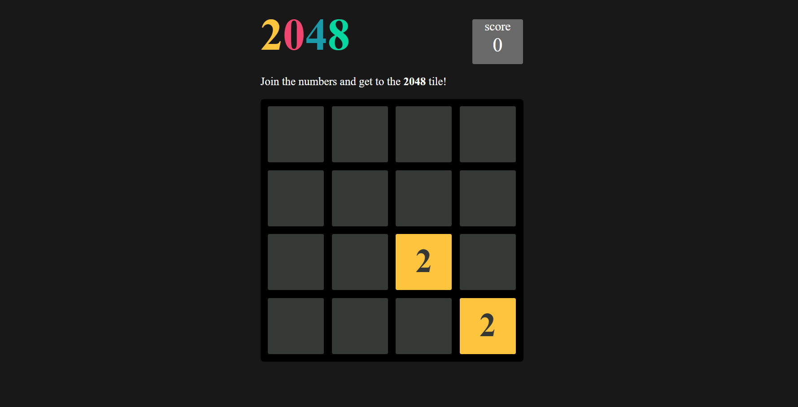

# 2048 Number Game



Welcome to the 2048 Number Game! This is a popular sliding block puzzle game built using HTML, CSS, and JavaScript. The objective of the game is to slide numbered tiles on a grid to combine them and create a tile with the number 2048.

## Table of Contents

- [Features](#features)
- [Demo](#demo)
- [Installation](#installation)
- [Usage](#usage)
- [How to Play](#how-to-play)
- [Contributing](#contributing)

## Features

- Simple and intuitive user interface
- Responsive design for different screen sizes
- Smooth sliding animations
- High score tracking
- Keyboard controls (arrow keys)
- Replay functionality

## Demo

You can try out the game live [here](https://omgupta7352.github.io/2048_number_game/).

## Installation

To run the 2048 Number Game locally, follow these steps:

1. **Clone the repository:**

    ```sh
    git clone https://github.com/omgupta7352/2048_number_game.git
    ```

2. **Navigate to the project directory:**

    ```sh
    cd 2048_number_game
    ```

## Usage

Once you have the game open in your browser, you can start playing immediately. Use the arrow keys on your keyboard to move the tiles. When two tiles with the same number touch, they merge into one with the sum of their values.

## How to Play

1. **Objective:** Combine the tiles to create a tile with the number 2048.
2. **Controls:** Use the arrow keys (Up, Down, Left, Right) to move the tiles in the corresponding direction.
3. **Combining Tiles:** When two tiles with the same number touch, they merge into one with the sum of their values.
4. **Game Over:** The game ends when there are no possible moves left.

## Contributing

Contributions are welcome! If you have any ideas or improvements, feel free to open an issue or create a pull request.

1. **Fork the repository**
2. **Create a new branch:** `git checkout -b feature/your-feature-name`
3. **Commit your changes:** `git commit -m 'Add some feature'`
4. **Push to the branch:** `git push origin feature/your-feature-name`
5. **Open a pull request**

